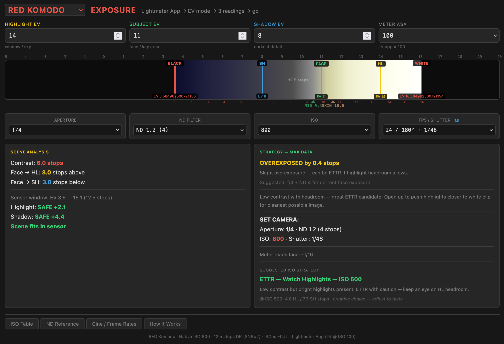

# Exposure Tool

**Live App:** [https://exposuretool.netlify.app/](https://exposuretool.netlify.app/)

## Why

Your lightmeter tells you **what the light is**. This tool tells you **if your camera can capture it** — and how to set exposure to maximize dynamic range. It bridges the gap between metering and camera settings, accounting for real sensor/film latitude and ISO behavior.

## How (Workflow)

1. **Select your profile** — RED Komodo, ARRI Alexa Mini, Leica M11, or Kodak film stock
2. **Meter your scene** — Take 3 readings with your lightmeter (LV @ ISO 100):
   - **Highlight:** Brightest area you want detail in (sky, window, practical)
   - **Face:** Subject skin tone (18% gray reference)
   - **Shadow:** Deepest shadow you want texture in
3. **Set your camera** — Enter aperture, ND, shutter (FPS or speed), ISO/EI
4. **Read the analysis:**
   - **Scene fits?** Green = safe, yellow = tight, red = exceeds DR
   - **Margins:** How many stops of headroom before clipping/crushing
   - **ISO strategy:** Profile-aware suggestion (ETTR, protect shadows, backlit handling, film push/pull)
   - **DR bar:** Visual map showing where your readings land on the sensor/film window

The tool calculates if your scene contrast fits within your camera's dynamic range at your chosen settings, shows exactly where highlights and shadows will fall, and suggests the optimal ISO/EI to maximize data capture.

## What (Profiles & Models)

**7 Camera/Film Profiles:**
- RED Komodo (12.5 stops, ISO metadata)
- ARRI Alexa Mini (13.5 stops, EI metadata)
- Leica M11 (14.5 stops @ ISO 64, real gain)
- Kodak Vision3 50D, 250D, 500T
- Kodak Double-X B&W

**3 Exposure Models:**
- **Digital-cinema** (RED, ARRI): ISO/EI is metadata — sensor window fixed, ISO shifts mid gray within it
- **Digital-stills** (Leica): ISO is real analog gain — DR shrinks at higher ISO
- **Film**: Fixed rated speed — push/pull changes latitude and grain

**Technical:** Single-file HTML app. No build, no dependencies. Mobile-responsive. Works offline.
